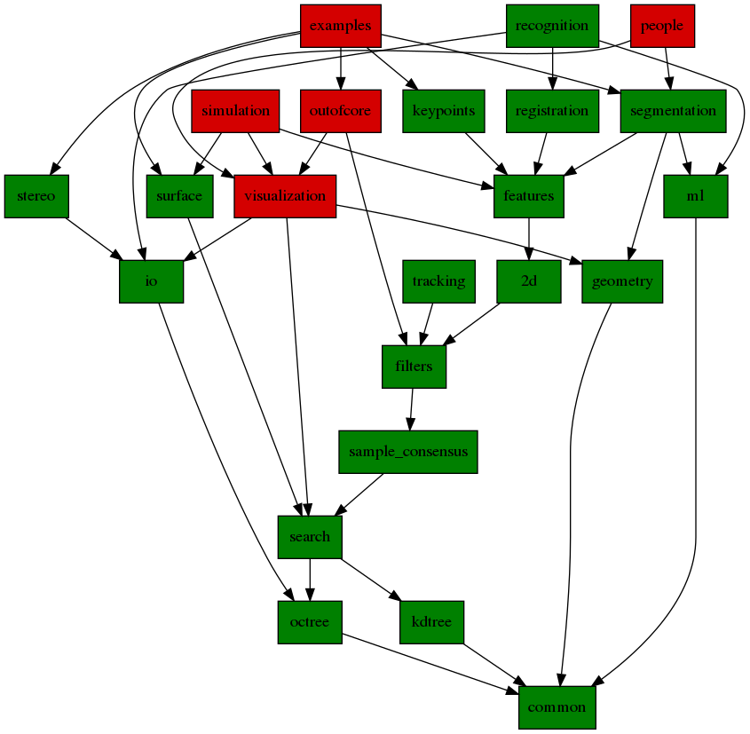

# FAQ Devel

## Q: How to fix "Could not import extension sphinxcontrib.doxylink.doxylink" error?

> ~/src/pcl-trunk/doc/tutorials$ make
> rm -rf html /tmp/doctrees
> sphinx-build -b html -a -d /tmp/doctrees content html
> Making output directory...
> Running Sphinx v1.0.1
> 
> Extension error:
> Could not import extension sphinxcontrib.doxylink.doxylink (exception: No module named sphinxcontrib.doxylink.doxylink)
> make: *** [html] Error 1

A: $ sudo easy_install -U sphinxcontrib-doxylink

(if you get an: error: command easy_install not found, do this: sudo apt-get install python-setuptools*)

(Quick note: If the problem persists, sphinx may be using a version of python for which doxylink is not installed - to find out which `sphinx-build` binary is being used, use `ccmake` and enter the advanced mode and look for `SPHINX_EXECUTABLE`. If you look at the top of that executable you can see which version of Python it is using)

## Q : Code builds on linux and mac and not on windows and gives errors with template arguments.

Line : void convolve (PointCloud<PointT> &output);
Errors : 
C:/BuildAgent/work/30b7299afa31c293/2d/include\pcl/2d/convolution.h(129, 0): error C2143: syntax error : missing ')'
before '<'
C:/BuildAgent/work/30b7299afa31c293/2d/include\pcl/2d/convolution.h(129, 0): error C2143: syntax error : missing ';'
before '<'

A : Using pcl::PointCloud instead of PointCloud solved the problem for me.

## PCL Libraries structure

## Current:

* Dependency graph generation requires a dot file generated while building the project with CMake:
  ```
  mkdir build && cd build && cmake {pcl_source_path}
  ```
  For more information, see [Compiling](https://github.com/PointCloudLibrary/pcl#compiling)

* PCL's dependency graph can be generated via:
  ```
  cd build && convert pcl.dot pcl_dependency_graph.png
  ```
  

* To generate one without the transitive dependencies, for a cleaner output, use:
  ```
  cd build && tred pcl.dot | dot -T png > pcl_dependency_graph_nontransitive.png
  ```
  

## Writing PCL exceptions

All the PCL exceptions should inherit from pcl::PCLException class.
This is an example
`class PCL_EXPORTS MyException : PCLException`
`{`
`    MyException (const std::string& error_description,`
`                 const std::string& file_name = "",`
`                 const std::string& function_name = "",`
`                 unsigned line_number = 0) throw ()`
`      : pcl::PCLException (error_description, file_name, function_name, line_number) { }`
`}`

## Building PCL with CUDA (gcc > 4.4)

 * Modify your nvvc.profile file (usually in /usr/local/cuda/bin/nvvc.profile) and add the following line at the top:
`
 compiler-bindir = /home/[user]/sbin/gcc-4.4
`
 to tell NVVC to use gcc-4.4 to compile CUDA code. /home/[user]/sbin/gcc-4.4 should contain links to 4.4 version of gcc/g++ like this:

```
 0 lrwxrwxrwx 1 user 1001 16 2011-07-01 16:12 c++ -> /usr/bin/g++-4.4
 0 lrwxrwxrwx 1 user 1001 16 2011-06-16 12:59 g++ -> /usr/bin/g++-4.4
 0 lrwxrwxrwx 1 user 1001 16 2011-06-16 12:59 gcc -> /usr/bin/gcc-4.4
```

## Locale support

For completing the `test_io` unit tests, you need to install `language-support-de`, i.e.:
```
apt-get install language-support-de
```
or
```
apt-get install language-pack-de
```

## How to make a release

* make sure you update the **PCL_VERSION** variable in the `CMakeLists.txt` of the branch that you're trying to release from
* make sure all the unit tests pass for all platforms (check `build.pointclouds.org` and set up custom tests)
* write up the Changelist to http://dev.pointclouds.org/projects/pcl/wiki/ChangeList
* tag the release in svn, e.g.:
```
git tag <tagname>
```
* send an e-mail to the list (pcl-users` and pcl-developers`)
* post a news announcement on pointclouds.org
